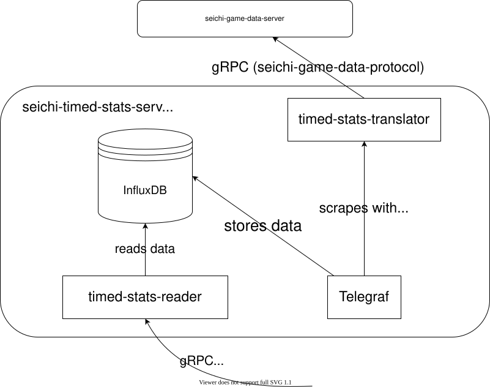

# seichi-timed-stats-server

[seichi-game-data-server](https://github.com/GiganticMinecraft/seichi-game-data-server) が提供する情報を
時系列上のデータとして読み出せるようにする一連のサービス。

サービスのAPIはgRPCにより提供されており、プロトコル定義は
[seichi-timed-stats-protocol](https://github.com/GiganticMinecraft/seichi-timed-stats-protocol)
にて管理されています。

## アーキテクチャ俯瞰図



## 開発環境のセットアップ

reader / translator のビルド (`cargo build` 等) には、Rust ツールチェイン (バージョンは各サーバーの
`rust-toolchain.toml` を参照) に加えて次のツールが必要です。

- [buf CLI](https://buf.build/docs/installation) — build.rs がコード生成に使います
  (バージョンは Dockerfile の `bufbuild/buf` イメージに揃えることを推奨)
- protoc — 依存クレート (pbjson-types など) のビルドに必要です (例: `brew install protobuf`)
- buf が使う protoc プラグイン — **PATH 上のバイナリがそのまま使われるため、
  バージョン違いのプラグインが入っていると互換性のない生成コードでビルドが壊れます。**
  必ずビルド対象サーバーのスクリプトでインストールしてください
  (バージョンは各サーバーの依存世代に合わせて独立に管理されています):

  ```sh
  ./servers/reader/install-buf-plugins.sh      # reader をビルドする場合
  ./servers/translator/install-buf-plugins.sh  # translator をビルドする場合
  ```
