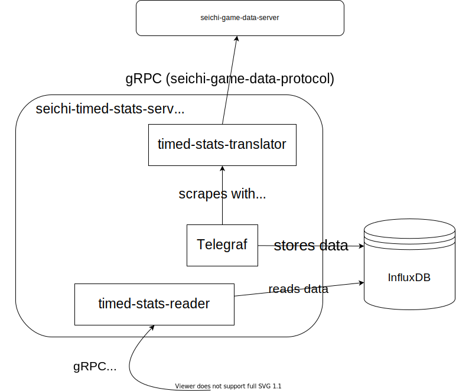

# seichi-timed-stats-server

[seichi-game-data-server](https://github.com/GiganticMinecraft/seichi-game-data-server) が提供する情報を
時系列上のデータとして読み出せるようにする一連のサービス。

サービスのAPIはgRPCにより提供されており、プロトコル定義は
[seichi-timed-stats-protocol](https://github.com/GiganticMinecraft/seichi-timed-stats-protocol)
にて管理されています。

## アーキテクチャ俯瞰図

